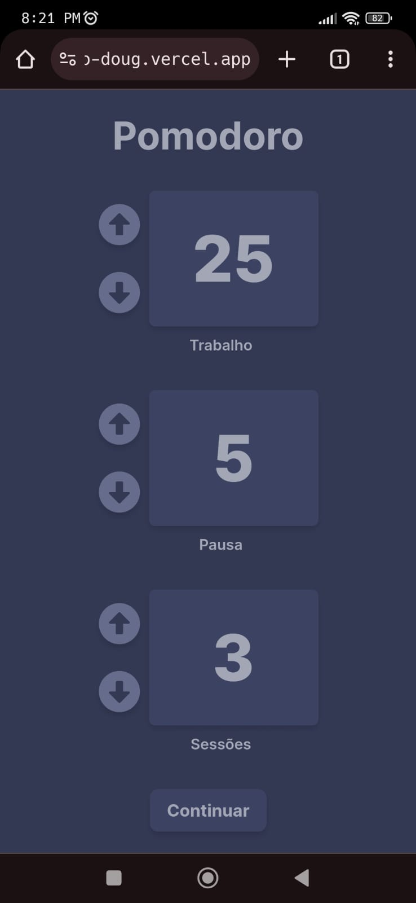
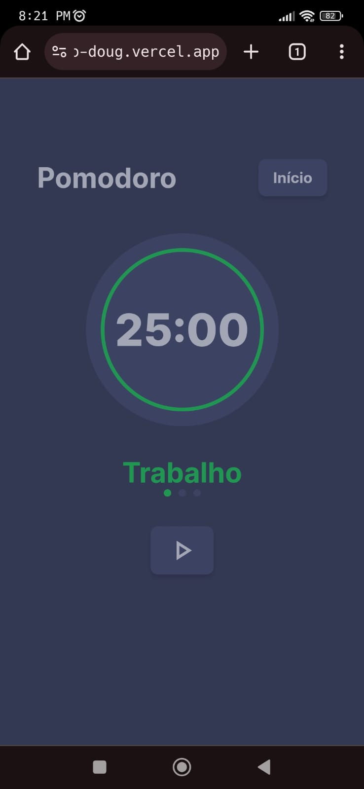

# Pomodoro
### A simple pomodoro app

## Application deployed in Vercel
https://pomodoro-doug.vercel.app/

## Installation
```bash
git clone https://github.com/douglasmatosdev/pomodoro.git

cd ./pomodoro

yarn install
```

## Run in Developement mode
```bash
yarn dev
```

## Build Production mode
```bash
yarn build
```


## Mobile
| Configuration | Countdown |
|-|-|
| |  |

## Desktop
| Configuration | Countdown |
|-|-|
|  |  |
